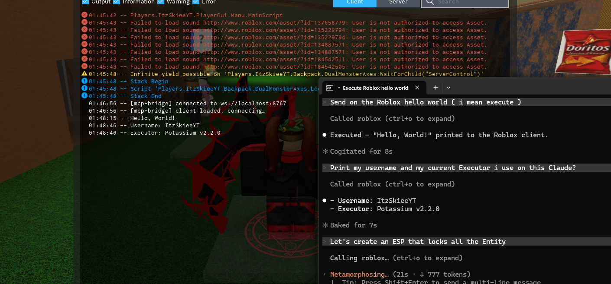
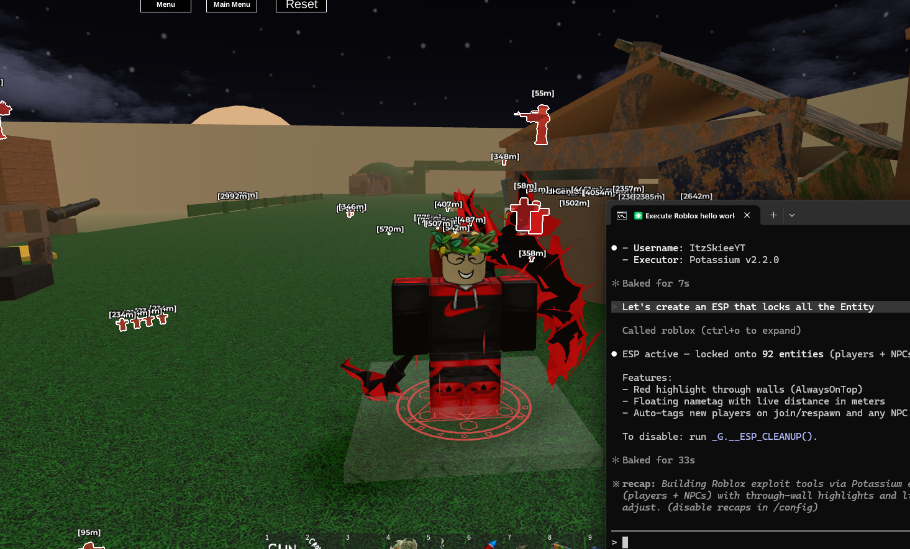

# RobloxMCP

> Control Roblox from any MCP-compatible AI (Claude, Gemini, Cursor, Continue) through your exploit executor's WebSocket.

---

## Introduction

**RobloxMCP** bridges an [MCP](https://modelcontextprotocol.io) server to a running Roblox client via WebSocket. The Roblox side is a single Lua script you run inside an executor (Solara, Potassium, Synapse, etc). Once the script connects back to the local MCP server, your AI assistant can read game state, run arbitrary Lua, see what's on screen, and drive the player — all through a stable tool interface.

```
AI (Gemini / Claude / Cursor) <--stdio or HTTP--> MCP Server <--WebSocket--> Roblox Executor
```

The AI gets a clean tool API. The executor handles every privileged action. The MCP server just routes.

---

## Core Features

- **`execute_lua`** — run arbitrary Lua in the executor environment. Full power.
- **Player tools** — list players, inspect, teleport, kick.
- **World tools** — list workspace, find parts by name/class, spawn parts, destroy instances.
- **`describe_view`** — AI vision substitute: camera state, on-screen players with screen coords + distance + occlusion check, nearby parts sorted by distance. Works on every executor.
- **`capture_screenshot`** — viewport → base64 PNG via `CaptureService`. Image content block returned so vision-capable models (Gemini, Claude) see it directly. Falls back to content ID when executor lacks file APIs.
- **Dev console capture** — all `print` / `warn` / `error` output from the game and the script is mirrored to a ring buffer. AI fetches with `get_dev_console_logs`.
- **Auto-reconnect** — Lua client reconnects with exponential backoff on drop.
- **Localhost-only** — WS bridge and MCP HTTP endpoint are intended for `127.0.0.1` use. Don't expose the WS port across the network without adding your own auth in front.

---

## Demo

Live, unedited captures of Claude Code driving Roblox through RobloxMCP.

### Walkthrough video

<video src="media/demo-full.mp4" controls width="720"></video>

> If the player doesn't render on your browser, [download / open `media/demo-full.mp4`](media/demo-full.mp4) directly.

### Quick clip

<video src="media/demo-quick.mp4" controls width="720"></video>

> Direct link: [media/demo-quick.mp4](media/demo-quick.mp4).

### Screenshots

**`execute_lua` — printing "Hello, World!" from the AI side:**



**AI builds an ESP over every entity in the game on request:**



---

## Requirements

- **Node.js** 18+ (for the MCP server)
- **npm**
- A **Roblox executor** with WebSocket support (see list below)
- An MCP-compatible AI client (Claude Desktop, Gemini CLI, Cursor, Continue, etc)

---

## Supported Executors

Any executor that exposes a WebSocket client API. Tested / known-good shims included:

- **Solara** ✅
- **Potassium** ✅
- **Synapse X** (`syn.websocket.connect`) ✅
- **Krnl** (`Krnl.WebSocket.connect`) ✅
- **Wave / Velocity / Fluxus / Trigon** — anything exposing global `WebSocket.connect` ✅

For full screenshot-to-base64 support the executor also needs `writefile` + `readfile` + `isfile` (most modern ones do). Without those, `capture_screenshot` returns just the content ID and `describe_view` still works as the vision path.

---

## How to Run

Three windows total: your **server terminal**, your **AI client**, your **Roblox + executor**. Once set up, daily use = just launch the server.

### One-time setup

```powershell
cd RobloxMCP
npm install
npm run build
```

### Every time you want to use it

**1. Start the server** (in its own PowerShell window — keep it open):

```powershell
cd "C:\path\to\ExecRobloxMCP"
node dist/index.js --http
```

You should see:

```
[bridge] WS listening on ws://0.0.0.0:8765
[RobloxMCP] HTTP MCP at http://127.0.0.1:8766/mcp (WS bridge port: 8765)
```

Want different ports? Set `MCP_HTTP_PORT` and/or `ROBLOX_WS_PORT` before the command. If you change `ROBLOX_WS_PORT`, also update `WS_URL` at the top of [roblox/client.lua](roblox/client.lua).

**2. Register with your AI client** (only the first time, or after a config wipe):

- **Claude Code** (CLI / VS Code):
  ```powershell
  claude mcp add roblox --scope user --transport http http://127.0.0.1:8766/mcp
  ```
  Then `/mcp` inside Claude Code to confirm `roblox · √ connected`.

- **Claude Desktop** — edit `%APPDATA%\Claude\claude_desktop_config.json`:
  ```json
  {
    "mcpServers": {
      "RobloxMCP": { "url": "http://127.0.0.1:8766/mcp" }
    }
  }
  ```
  Then fully quit + reopen Claude Desktop (system tray, not just the window).

- **Cursor** — Settings → MCP → Add new MCP server:
  ```json
  {
    "mcpServers": {
      "roblox": { "url": "http://127.0.0.1:8766/mcp" }
    }
  }
  ```
  (Or edit `~/.cursor/mcp.json` directly with the same content.) Restart Cursor.

- **Gemini CLI** — edit `~/.gemini/settings.json`:
  ```json
  {
    "mcpServers": {
      "roblox": { "httpUrl": "http://127.0.0.1:8766/mcp" }
    }
  }
  ```
  New shells of `gemini` pick it up automatically.

- **OpenAI Codex CLI** — edit `~/.codex/config.toml`:
  ```toml
  [mcp_servers.roblox]
  url = "http://127.0.0.1:8766/mcp"
  ```
  Restart `codex`.

- **Continue (VS Code / JetBrains)** — add to `~/.continue/config.json` under `experimental.modelContextProtocolServers`:
  ```json
  {
    "transport": { "type": "streamable-http", "url": "http://127.0.0.1:8766/mcp" }
  }
  ```
  Reload the IDE window.

- **Anything else MCP-compatible** — point it at `http://127.0.0.1:8766/mcp` using whichever HTTP transport key it expects (`url`, `httpUrl`, `endpoint`, etc.). If your client only speaks stdio, see *Advanced: stdio mode* at the bottom.

**3. Inject the Lua client** into Roblox:

1. Join the Roblox experience you want to control.
2. Open your executor (Solara, Wave, Krnl, etc).
3. Paste the contents of [roblox/client.lua](roblox/client.lua) and execute.

Roblox dev console (F9) should show:
```
[mcp-bridge] client loaded, connecting…
[mcp-bridge] connected to ws://localhost:8765
```

Your **server terminal** will also print `[bridge] incoming connection from ::1`.

**4. Use it.** Ask your AI anything:

- *"List all players."*
- *"What can you see right now?"* (uses `describe_view`)
- *"Teleport me next to PlayerName."*
- *"Take a screenshot."*
- *"Run this Lua: `return Workspace:GetChildren()`"*
- *"Show me the last 50 dev console errors."*

### Health check

In any shell: `curl http://127.0.0.1:8766/health` → `{"ok":true,"roblox_connected":true|false}`.

### Stopping it

- **Server:** Ctrl+C in the server terminal (or close the window).
- **Roblox side:** rejoin / re-execute / disconnect — server holds no persistent state.

### Troubleshooting

| Symptom | Likely cause | Fix |
| --- | --- | --- |
| Server: `EADDRINUSE` | Another node already on 8765/8766 | Kill it: `Get-NetTCPConnection -LocalPort 8766 -State Listen \| %{ taskkill /F /PID $_.OwningProcess }` |
| AI client says "connection refused" | Server not running | Start the server (step 1) |
| `/mcp` shows roblox `× failed` | Server crashed or never started | Check the server terminal output |
| Tool call: "Roblox client not connected" | Lua not running in executor | Re-paste + execute [roblox/client.lua](roblox/client.lua) |
| Roblox console: `connect failed: ... retry in Xs` | Server not running OR wrong `WS_URL` | Start server, confirm port matches |

### Advanced: stdio mode

Skip step 1 entirely and let your AI client manage the server lifecycle:

```powershell
claude mcp add roblox node "C:\path\to\ExecRobloxMCP\dist\index.js" --scope user
```

Tradeoff: when Claude Code closes, the server dies and Roblox disconnects. HTTP mode (above) avoids that.

---

## Protocol (for hackers)

```
MCP → Roblox: {"id":"uuid","action":"...","...":...}
Roblox → MCP: {"id":"uuid","ok":true|false,"result"|"error":...}
Unsolicited:  {"event":"log","level":"info|warn|error","message":"..."}
```

Add a tool = add an entry in [src/tools.ts](src/tools.ts) plus a handler in `actions` inside [roblox/client.lua](roblox/client.lua). That's it.

---

## Credit

Made by **SkieHacker**.

If you fork, build on top, or include this in another project, keep the copyright line in `LICENSE`. That's the only string attached.

---

## License

MIT — see [LICENSE](LICENSE).

You can use, modify, distribute, and sell it. You only must preserve the copyright notice and the license text. Don't strip the credit.
